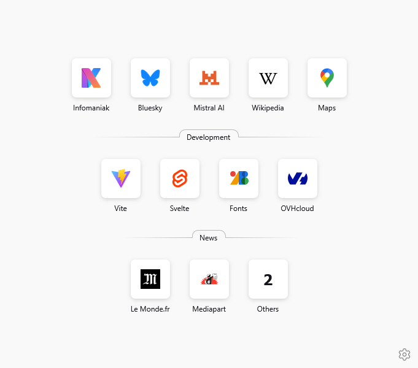
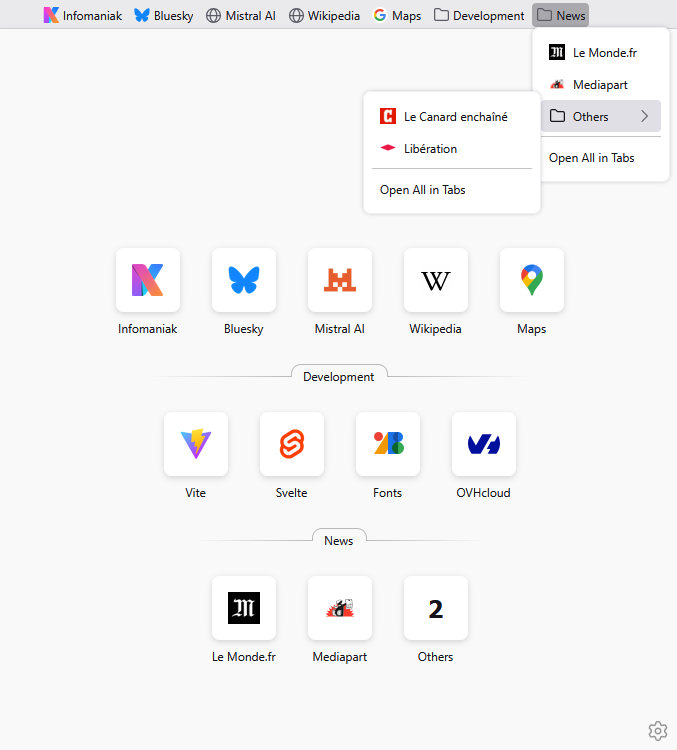
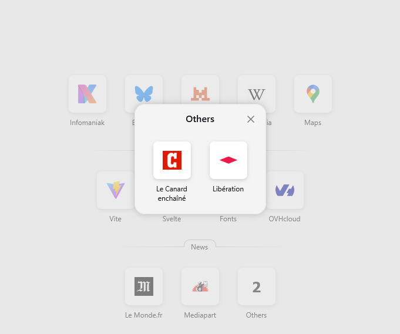
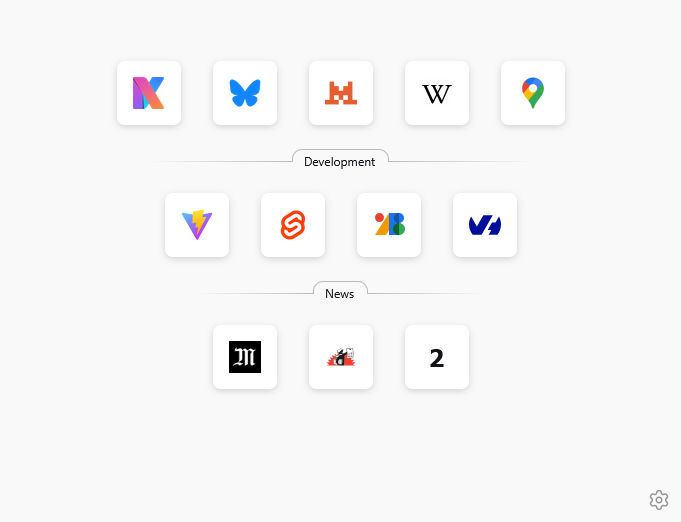
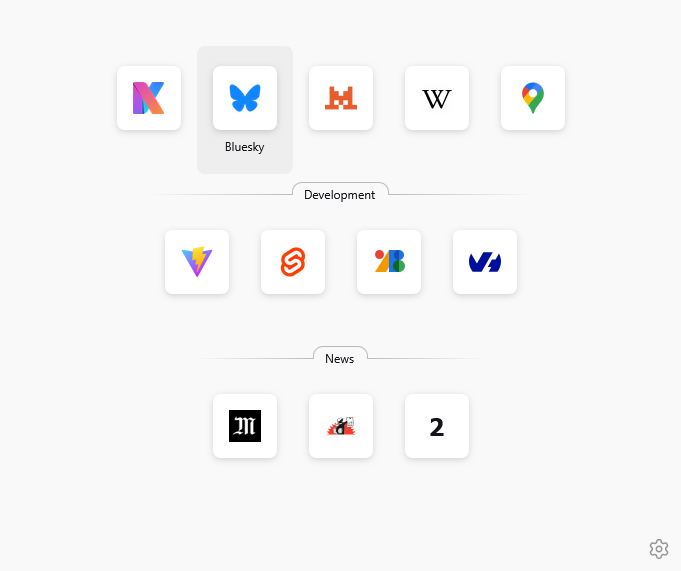
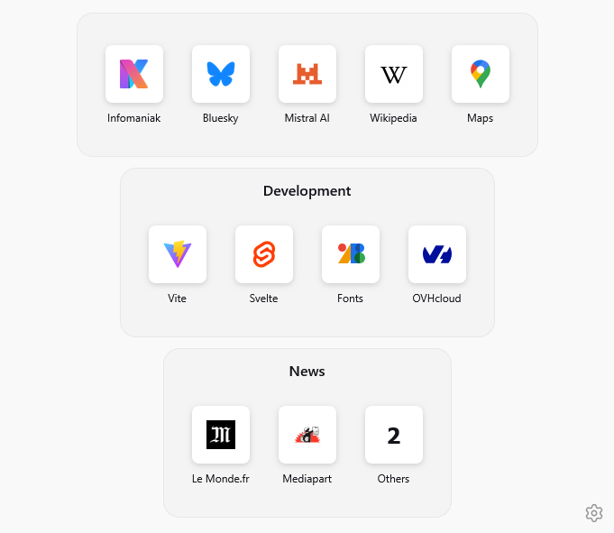
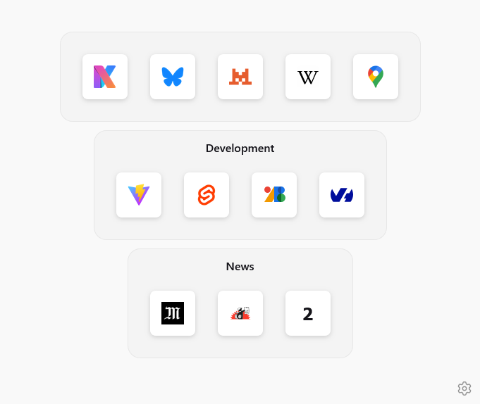
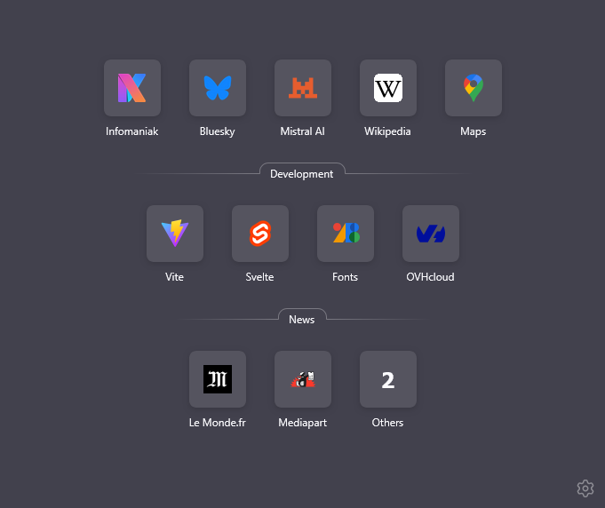
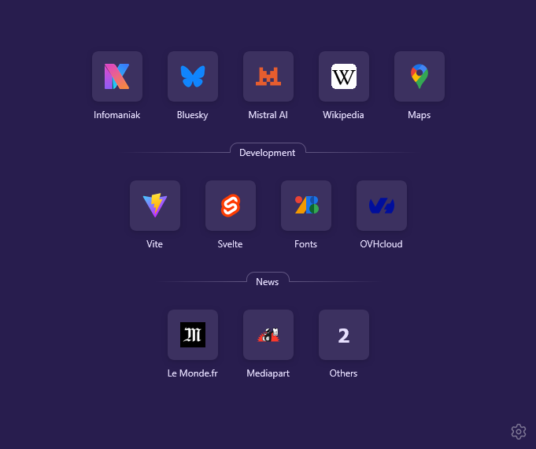
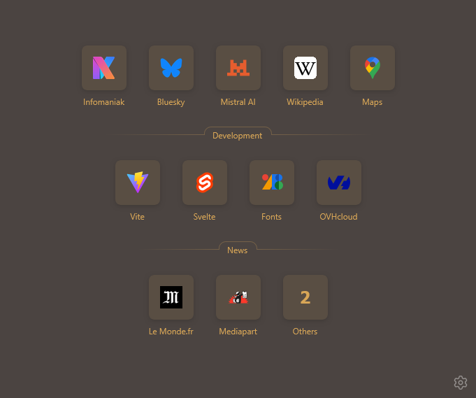

# Setup

## Installation

```
pnpm i
```

## Webapp

To build the Svelte webapp, run:

```
pnpm build --watch
```

To see it in action, go to `about:debugging#/runtime/this-firefox`, click "Load temporary Add-on..." and select `./manifest.json`.

## Package

To build the webapp and package the extension using web-ext, run:

```
pnpm package
```

It generates a zip file in the releases directory.

# About

**NewTab Bookmarks** is Firefox extension is a replacement for the native newtab page.

It displays the toolbar bookmarks, using the same look and feel as the top-most sites of the native newtab page.

No search field, no top-most sites, only bookmarks.



## Toolbar Bookmarks

The bookmarks displayed in the page come from the toolbar:



Subfolders are displayed as popup:



## Labels

Labels can be hidden:



Or only visible on hover:



## Layouts

Default layout uses tab-like group title.

An alternative layout is available. It uses blocks:



The blocks layout without labels:



## Themes

The newtab page follows the chosen Firefox theme.

Dark mode is supported:



Themes are supported:




```

```
