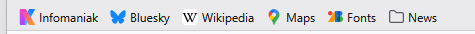
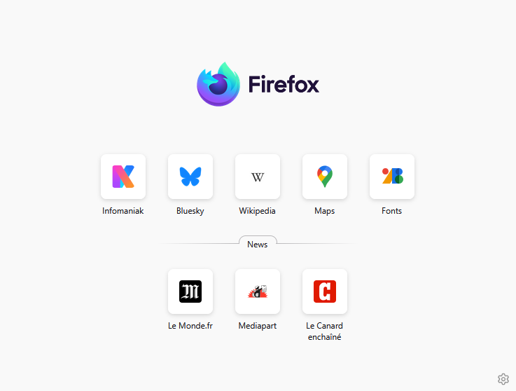

# NewTab page with Bookmarks

This Firefox extension is a replacement for the native newtab page.

It displays the toolbar bookmarks, using the same look and feel as the top-most sites of the native newtab page.

No search field, no top-most sites, only bookmarks.

## Example

These toolbar bookmarks:

are displayed like that :

